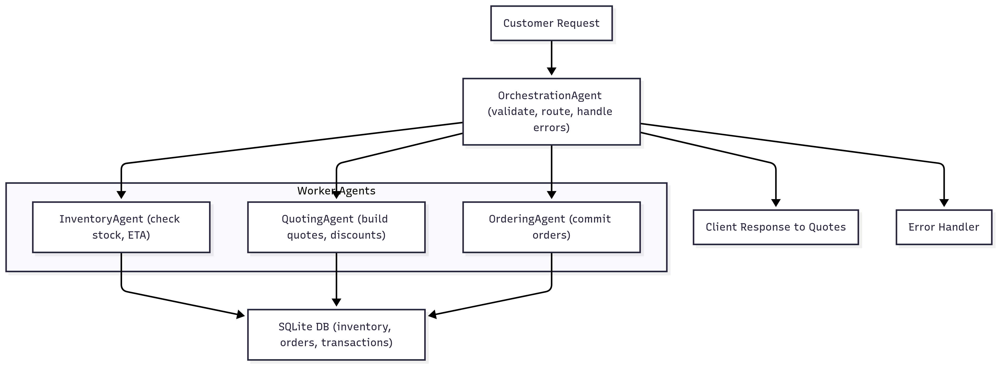

# Multi-Agents Project

This repository demonstrates a true multi-agent orchestration system. Multiple agents — inventory, quoting, and ordering — work collaboratively in a pipeline, coordinated by the `orchestrator.py` module. Each agent handles a specific responsibility, and the orchestrator manages the flow of data and task sequencing.



## Features

- **True multi-agent orchestration:** Agents are coordinated in a pipeline, not combined into a single monolithic agent.
- **Modular agents:** Inventory, quoting, and ordering agents operate independently.
- **Pipeline workflow:** Inventory → Quoting → Ordering.
- **Extensible:** Easily add new agents or tools.
- **Example scenarios:** Includes CSV-driven request simulations.

## Architecture

The architecture follows a pipeline model:

```
Customer Request
    │
    ▼
 Inventory Agent   (checks stock, recommends alternatives)
    │
    ▼
 Quoting Agent     (generates quote based on inventory & history)
    │
    ▼
 Ordering Agent    (finalizes order, records transaction, estimates delivery)
    │
    ▼
 Customer Response
```

The orchestrator (`orchestrator.py`) coordinates this flow, passing outputs from one agent to the next and handling errors at each stage.

## Getting Started

1. **Clone the repository:**
    ```bash
    git clone https://github.com/your-username/Multi-agents-project.git
    cd Multi-agents-project
    ```

2. **Install dependencies:**
    ```bash
    poetry install
    ```

3. **Initialize the database and run test scenarios:**
    ```bash
    python main.py
    ```

The `main.py` script loads sample requests from CSV, runs them through the multi-agent pipeline, and outputs responses along with updated financial and inventory states.

## Project Structure

```
.
├── agents.py                 # Inventory, quoting, and ordering agent definitions
├── orchestrator.py           # Multi-agent orchestrator coordinating the pipeline
├── entities.py               # Pydantic models for requests, quotes, and errors
├── main.py        # Main script to initialize DB and run test scenarios
├── multi-agents-architecture-diagram.png
├── README.md
└── poetry.toml
```
